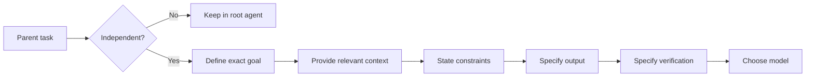

<div align="center">

# Karpathy-Inspired Coding Agent Guidelines

**Personal ChatGPT 5.6 coding rules optimized for `~/.codex/AGENTS.md`.**

`GPT-5.6` · `Codex` · `subagents` · `minimal diffs` · `clean commits`

</div>

---

## Scope

This is my personal fork of [`forrestchang/andrej-karpathy-skills`](https://github.com/forrestchang/andrej-karpathy-skills), adapted for my **global Codex instructions**:

```text
~/.codex/AGENTS.md
```

> [!IMPORTANT]
> This is optimized for **personal, cross-project instructions loaded in every Codex session**.
>
> It is **not intended to replace repository-level `AGENTS.md` files**.

Project-specific rules should stay inside each repository's own `AGENTS.md`, `CLAUDE.md`, `CONTRIBUTING.md`, or equivalent documentation.

This file should contain only behavior I want across essentially every coding task.

---
## What Changed

| Area                 | This fork                                                            |
| -------------------- | -------------------------------------------------------------------- |
| **Core behavior**    | Keeps the original Karpathy-inspired principles                      |
| **Task structure**   | Defines trivial, linear, and parallelizable work                     |
| **Subagents**        | Adds explicit rules for when delegation is useful                    |
| **Context handoff**  | Requires goal, context, constraints, output, and verification        |
| **Model routing**    | Uses GPT-5.6 models according to subtask difficulty                  |
| **Verification**     | Keeps the parent agent responsible for reviewing delegated work      |
| **Commits**          | Requires cohesive commits with a useful subject and explanatory body |
| **Repository scope** | Removes Claude/Cursor-specific packaging I do not use                |

I removed:

```text
.claude-plugin/marketplace.json
.claude-plugin/plugin.json
.cursor/rules/karpathy-guidelines.mdc
CLAUDE.md
CURSOR.md
EXAMPLES.md
README.zh.md
```

The fork is intentionally narrower: **one behavioral guideline set for my ChatGPT coding workflow**.

---

## Why Add Subagent Rules?

The original guidelines focus mainly on how a single coding agent behaves.

Modern ChatGPT coding workflows can also delegate work to subagents, which introduces another class of mistakes:

1. parallelizing work that is actually sequential;
2. delegating without enough context;
3. spawning an unnecessarily capable model for simple investigation;
4. accepting subagent output without verification.

One concrete behavior that motivated this section was seeing a **GPT-5.6 Sol root agent spawn another GPT-5.6 Sol at high reasoning effort primarily to explore a codebase**.

That worked, but the delegated job was bounded enough that a cheaper GPT-5.6 model could likely have handled it.

> [!IMPORTANT]
> That Sol → Sol behavior is **my observation**, not a documented OpenAI default.

### What OpenAI Documents

OpenAI documents GPT-5.6 as supporting **multi-agent execution**, including concurrent subagents whose results can be synthesized into the parent request.[^gpt56-multiagent]

OpenAI's model guidance also notes that delegation behavior should be explicitly prompted when the model delegates less often than desired.[^model-guidance]

GPT-6 Astra is separately described as being trained to divide work and delegate it to parallel subagents.[^model-guidance]

OpenAI does **not** document GPT-5.6 subagents as being unavailable or blocked by default.

For that reason, this fork treats subagent behavior as something that should be **explicitly orchestrated**, rather than relying on implicit model behavior.

---

## Linear vs. Parallel Work

These are terms used by this project to make delegation decisions.

### Linear

A task is **linear** when a later step materially depends on an earlier result:

```text
A → B → C
```

Examples:

```text
reproduce bug → identify cause → implement fix
inspect API → understand contract → implement integration
change abstraction → migrate callers → remove old path
```

If `B` needs the result of `A`, they should not be concurrent subagents.

### Parallelizable

A task is **parallelizable** when independent branches can produce useful results without waiting on one another:

```text
        ┌── B ──┐
A ──────┼── C ──┼── E
        └── D ──┘
```

Examples:

* inspect unrelated modules;
* investigate independent hypotheses;
* search separate implementations;
* run independent test suites;
* research unrelated APIs.

The practical test:

> **Can each subagent complete its assignment correctly without another concurrent subagent's result?**

If not, keep the work serial.

---

## Subagent Context Handoff

A subagent needs enough context to complete its assignment without rediscovering what the parent already knows.

Every delegation should specify:

```text
Goal:
  Exact outcome to achieve.

Context:
  Relevant files, modules, behavior, errors, and conclusions
  already established.

Constraints:
  Scope boundaries, project rules, and things that must not change.

Output:
  Exact information or change expected.

Verify:
  How the result can be checked.
```

The target is **minimum sufficient context**.

Too little context causes guessing and duplicated investigation.

Too much unrelated context wastes tokens and makes the actual task harder to identify.



---

## GPT-5.6 Model Routing

OpenAI currently provides three GPT-5.6 tiers relevant to this workflow:

| Model             | OpenAI positioning                                         |
| ----------------- | ---------------------------------------------------------- |
| **GPT-5.6 Sol**   | Flagship GPT-5.6 model for complex professional work[^sol] |
| **GPT-5.6 Terra** | Balance of intelligence and cost[^terra]                   |
| **GPT-5.6 Luna**  | Cost-sensitive, high-volume workloads[^luna]               |

The following routing policy is **my convention**, not an OpenAI-prescribed algorithm.

### My Default


**Luna** is my default for bounded delegated work such as:

* exploring a codebase;
* locating symbols and call sites;
* reading tests or logs;
* documentation lookup;
* collecting implementation details;
* narrow reviews;
* other focused investigation.

**Terra** is the middle step when Luna is insufficient but the work does not justify Sol.

**Sol** remains appropriate for:

* architecture;
* ambiguous debugging;
* difficult implementation decisions;
* cross-cutting modifications;
* synthesis of conflicting findings;
* high-consequence work.

A Sol root agent therefore does **not** imply Sol subagents.

The desired rule is:

> **Use the least expensive model that can reliably complete the bounded task, then escalate when necessary.**

OpenAI describes Luna as the fastest/lowest-cost GPT-5.6 option in its ChatGPT documentation and as optimized for cost-sensitive, high-volume workloads in its API documentation.[^chatgpt56][^luna]

The official model pages also document higher reasoning-effort options for the GPT-5.6 family.[^sol][^terra][^luna]

---

## Commit Workflow

The fork also codifies how I want coding agents to finish changes.

The goal is not merely to produce a valid commit. The history should make it possible to understand **what changed, why it changed, and how it was verified before opening the diff**.

### Commit Structure

Use a short **commit subject** followed by a useful **commit body** for non-trivial changes.

```text
<type>: <imperative summary>

<description of what changed and why>

<important implementation or scope details>

Validation:
- <check performed>
- <check performed>
```

Example:

```text
feat: add model-aware subagent routing

Define linear and parallelizable task shapes and require explicit
context handoff before spawning subagents.

Default bounded exploration work to GPT-5.6 Luna instead of blindly
matching the parent model. Reserve Sol for ambiguous, cross-cutting,
or high-consequence tasks.

Also document the distinction between observed model behavior,
OpenAI-documented behavior, and project-specific orchestration policy.

Validation:
- reviewed guideline consistency
- verified OpenAI-specific claims against official documentation
```

### Subject

The subject should be concise and useful when scanning history.

Use repository-specific formatting rules when they exist. Otherwise use:

```text
feat:
fix:
docs:
test:
refactor:
build:
ci:
chore:
```

with an imperative summary:

```text
fix: preserve query strings during language selection
```

The subject answers:

> **What kind of change is this, and what did it accomplish?**

### Body

For non-trivial commits, the body should summarize the change well enough that someone can understand its intent and scope **without reading the implementation first**.

It should answer, when relevant:

* **What changed?**
* **Why was it necessary?**
* **What important design or behavioral decisions were made?**
* **What part of the repository is affected?**
* **What was deliberately left unchanged?**
* **How was the result verified?**

Do not merely restate the subject.

Do not narrate the diff line by line.

Prefer a concise description of the **behavioral change and reasoning behind it**.

> [!TIP]
> Think of the commit body as the index to the diff: after reading it, you should know what to look for and why those changes exist.

For trivial changes, such as a typo or obvious one-line fix, a subject alone is sufficient.

### Git Rules

* Only commit changes related to the current task.
* Keep commits self-contained.
* Preserve a linear history.
* Always specify the remote and branch when pushing:

```bash
git push origin <branch>
```

* Do not run `git log`, `rebase`, `merge`, or `force push` by default.
* Do not include unrelated working-tree changes.
* Do not commit test captures, temporary logs, generated `dist/` output, or unrelated binaries unless the repository explicitly requires them.

Repository-specific instructions in `AGENTS.md`, `CLAUDE.md`, or equivalent documentation take precedence.

The agent should not rewrite history or perform broader repository maintenance merely because it has access to Git.

---

## The Guidelines

The resulting behavioral model is:

| Principle                 | Prevents                                                     |
| ------------------------- | ------------------------------------------------------------ |
| **Think Before Coding**   | Silent assumptions and hidden uncertainty                    |
| **Simplicity First**      | Overengineering and speculative abstraction                  |
| **Surgical Changes**      | Drive-by refactors and unrelated edits                       |
| **Goal-Driven Execution** | Vague completion criteria                                    |
| **Subagents**             | Bad decomposition, missing context, wasted model capability  |
| **Commits**               | Opaque history, unrelated changes, and unsafe Git operations |

The overall rule:

> **Give the agent a precise goal, enough context to solve it, clear scope boundaries, and a verifiable definition of success — then leave a commit that explains what was accomplished.**

---

## Source Discipline

This README separates three kinds of claims:

| Type                         | Meaning                                           |
| ---------------------------- | ------------------------------------------------- |
| **Official OpenAI behavior** | Supported by OpenAI documentation and cited below |
| **Observed behavior**        | Something I encountered while using ChatGPT       |
| **Project policy**           | A convention I deliberately chose for this fork   |

If an OpenAI-specific claim cannot be supported by official documentation, it should not be presented here as fact.

---

## References

[^karpathy]: **Andrej Karpathy — observations on LLM coding behavior.** X post `2015883857489522876`. Original motivation for the behavioral guidelines.

[^upstream]: **forrestchang/andrej-karpathy-skills.** Original GitHub repository from which this fork derives.

[^gpt56-multiagent]: **OpenAI — “GPT-5.6: Frontier intelligence that scales with your ambition.”** Official GPT-5.6 launch article. See the discussion of multi-agent execution and concurrent subagents. Available on `openai.com`.

[^model-guidance]: **OpenAI Developers — “Model guidance.”** See the sections covering subagent delegation and initiative/follow-through. Available in OpenAI Developers → **API docs → Guides → Model guidance**.

[^chatgpt56]: **OpenAI Help Center — “GPT-5.6 and GPT-6 Pro in ChatGPT.”** Includes GPT-5.6 model availability and positioning. Search the OpenAI Help Center by the exact article title.

[^sol]: **OpenAI Developers — “GPT-5.6 Sol Model.”** Official model reference. OpenAI Developers → **API docs → Models → GPT-5.6 Sol**.

[^terra]: **OpenAI Developers — “GPT-5.6 Terra Model.”** Official model reference. OpenAI Developers → **API docs → Models → GPT-5.6 Terra**.

[^luna]: **OpenAI Developers — “GPT-5.6 Luna Model.”** Official model reference. OpenAI Developers → **API docs → Models → GPT-5.6 Luna**.

---

## Attribution

Based on [`forrestchang/andrej-karpathy-skills`](https://github.com/forrestchang/andrej-karpathy-skills) and the coding-agent observations that originally motivated that project.[^upstream][^karpathy]

## License

MIT
