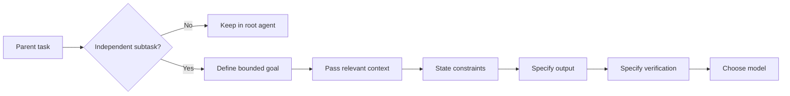
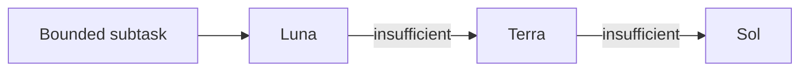

<div align="center">

# Karpathy-Inspired Coding Agent Guidelines

**Small behavioral rules for coding agents: think first, change less, verify the result, and delegate intentionally.**

`GPT-5.6` · `multi-agent` · `coding agents` · `minimal diffs` · `MIT`

</div>

---

## What This Fork Changes

The original project packaged four useful rules for reducing common LLM coding mistakes.

This fork keeps that core, removes tool-specific duplication, and extends the guidelines for **modern multi-agent coding workflows**.

| Area                    | Change                                                                                 |
| ----------------------- | -------------------------------------------------------------------------------------- |
| **Core guidelines**     | Preserve the original Think / Simplicity / Surgical / Goal-Driven principles           |
| **Task classification** | Distinguish trivial, linear, and parallelizable work                                   |
| **Subagents**           | Define when delegation helps and when it only adds coordination                        |
| **Context handoff**     | Require an explicit goal, relevant context, constraints, output, and verification      |
| **Model routing**       | Match GPT-5.6 model capability to the delegated task instead of cloning the root model |
| **Git discipline**      | Add cohesive commit and safe-push rules                                                |
| **Repository scope**    | Remove Claude/Cursor-specific wrappers and duplicated documentation                    |

The following integration-specific files were removed:

```text
.claude-plugin/marketplace.json
.claude-plugin/plugin.json
.cursor/rules/karpathy-guidelines.mdc
CLAUDE.md
CURSOR.md
EXAMPLES.md
README.zh.md
```

The goal is a smaller repository centered on the **behavioral contract**, not multiple copies of the same rules for different tools.

---

## Why Add Subagent Rules?

The original four principles predate the current multi-agent workflow.

Delegation introduces two additional failure modes:

1. **Parallelizing work that is actually sequential**
2. **Using an unnecessarily expensive model for a bounded subtask**

During development of this fork, I observed a GPT-5.6 Sol root agent spawn another **GPT-5.6 Sol at high reasoning effort** primarily to explore the codebase.

That worked, but codebase discovery was a bounded task that did not necessarily require another Sol instance.

> [!IMPORTANT]
> This is an **observed orchestration failure**, not a documented OpenAI default.

The new subagent rules are intended to prevent that class of waste.

### What OpenAI Actually Documents

OpenAI documents that GPT-5.6 supports **multi-agent execution**, including concurrent subagents whose results can be synthesized into one request.[^gpt56-multiagent]

OpenAI's current model guidance also says that delegation can happen **less often than desired** unless the harness explicitly specifies when and how subagents should be used.[^model-guidance]

For GPT-6 Astra specifically, OpenAI states that the model is trained to divide work and delegate it to parallel subagents.[^model-guidance]

> [!NOTE]
> OpenAI does **not** document GPT-5.6 subagents as "blocked by default."
>
> This fork therefore treats delegation as an **orchestration policy that should be stated explicitly**, rather than assuming a particular hidden default.

---

## Linear vs. Parallel Work

These are **project terms**, not OpenAI model terminology.

A task is **linear** when a later step materially depends on the result of an earlier step:

```text
A → B → C
```

Examples:

```text
reproduce bug → determine cause → implement fix → verify fix
inspect API → understand contract → implement integration
change abstraction → migrate callers → remove old path
```

Do not split those stages into concurrent subagents.

A task is **parallelizable** when independent branches can produce useful results without waiting on one another:

```text
        ┌── B ──┐
A ──────┼── C ──┼── E
        └── D ──┘
```

Examples:

* inspect independent modules;
* search several unrelated implementations;
* investigate independent hypotheses;
* run independent test suites;
* research separate APIs.

The practical test is:

> **Can each subagent complete its assignment correctly without needing another concurrent subagent's result?**

If not, keep the work serial.

---

## Subagent Handoff

A subagent does not become useful merely because work was delegated to it.

It needs enough context to perform the bounded task without rediscovering everything the parent already knows.

Every delegation should provide:

```text
Goal:
  Exact result the subagent should produce.

Context:
  Relevant files, modules, behavior, errors, and conclusions
  already established by the parent.

Constraints:
  Scope boundaries, repository rules, and things that must
  not change.

Output:
  Exact information or change expected from the subagent.

Verify:
  How the parent can determine whether the result is correct.
```

### Minimum Sufficient Context

The goal is not maximum context.

The goal is **minimum sufficient context**.

Too little context causes rediscovery, incorrect assumptions, and duplicated work.

Too much unrelated context wastes tokens and can obscure the actual task.



---

## GPT-5.6 Model Routing

OpenAI currently describes the GPT-5.6 family as three capability/cost tiers:

* **Sol** — flagship model for complex professional work.[^sol]
* **Terra** — balances intelligence and cost.[^terra]
* **Luna** — optimized for cost-sensitive, high-volume workloads and described elsewhere by OpenAI as fast and economical for focused or repetitive work.[^luna][^usage]

All three GPT-5.6 API model pages currently list reasoning efforts including `high`, `xhigh`, and `max`.[^sol][^terra][^luna]

> [!IMPORTANT]
> The routing rules below are **this project's policy**, not an OpenAI-prescribed routing algorithm.

### Recommended Routing

| Model                              | Use it for                                                                                                                                             |
| ---------------------------------- | ------------------------------------------------------------------------------------------------------------------------------------------------------ |
| **GPT-5.6 Luna `high` / `xhigh`**  | Codebase exploration, locating symbols, inspecting call sites, extracting information, reading tests/logs, narrow reviews, other bounded investigation |
| **GPT-5.6 Terra `high` / `xhigh`** | Routine implementation or analysis that exceeds Luna but does not require flagship reasoning                                                           |
| **GPT-5.6 Sol**                    | Root-agent work, ambiguous debugging, architecture, difficult implementation, cross-cutting changes, synthesis, high-consequence decisions             |

The default escalation path is:



Do **not** automatically use the root agent's model for every child.

A Sol root does not imply a Sol subagent.

Likewise, using Luna only makes sense when the task is:

* tightly scoped;
* supplied with sufficient context;
* straightforward to verify;
* low-cost to retry or escalate.

### Why Luna Is Useful Here

OpenAI describes GPT-5.6 Luna as the fastest and lowest-cost GPT-5.6 tier in its ChatGPT documentation and as a model for cost-sensitive, high-volume workloads in its API documentation.[^chatgpt56][^luna]

Its API model page also explicitly supports higher reasoning settings, including `high` and `xhigh`.[^luna]

That makes Luna a reasonable **project default for bounded delegated investigation**.

It does **not** imply that Luna is always sufficient.

Escalate when:

* architectural judgment appears;
* important ambiguity remains;
* the child cannot reach a defensible conclusion;
* the result is expensive or difficult to verify;
* the work becomes cross-cutting;
* mistakes would have significant consequences.

---

## Where Does Astra Fit?

GPT-6 Astra is **not the focus of this fork's routing policy**.

OpenAI describes Astra as its most capable model for coding, research, analysis, and complex problem solving.[^usage]

Its model guidance also explicitly describes Astra as trained to divide work and delegate it to parallel subagents.[^model-guidance]

That makes Astra relevant for long-horizon or difficult orchestration, but it does not remove the need for explicit task decomposition and model selection when using the GPT-5.6 family.

This fork is primarily concerned with making:

```text
Sol / Terra / Luna
```

behave efficiently inside multi-agent coding workflows.

---

## The Guidelines

The original principles remain the foundation.

| Principle                 | Prevents                                                               |
| ------------------------- | ---------------------------------------------------------------------- |
| **Think Before Coding**   | Silent assumptions, hidden uncertainty, ignored tradeoffs              |
| **Simplicity First**      | Overengineering, speculative abstractions, unnecessary configurability |
| **Surgical Changes**      | Drive-by refactors and unrelated modifications                         |
| **Goal-Driven Execution** | Vague completion criteria and unverified changes                       |
| **Subagents**             | Bad decomposition, duplicated work, unnecessary model cost             |
| **Commits**               | Unrelated changes, unsafe Git operations, incoherent history           |

The overall rule is:

> **Give the agent a precise goal, constrain unnecessary behavior, and make success verifiable.**

---

## Source Discipline

Claims about OpenAI model behavior in this README are intentionally limited to what can be supported by **official OpenAI documentation**.

Observations from local use are labeled as observations.

Project recommendations are labeled as project policy.

No claim about model behavior should be presented as an OpenAI guarantee unless the official documentation supports it.

---

## References

[^karpathy]: **Andrej Karpathy — observations on LLM coding behavior.** X post `2015883857489522876`. This is the original motivation for the four behavioral principles.

[^upstream]: **forrestchang/andrej-karpathy-skills.** Original GitHub repository. See the upstream `CLAUDE.md` for the original four-rule implementation and its README for the original packaging.

[^gpt56-multiagent]: **OpenAI — “GPT-5.6: Frontier intelligence that scales with your ambition.”** Official GPT-5.6 launch article. See the **Availability and pricing** section, where OpenAI describes GPT-5.6 multi-agent support and concurrent subagents. Find it on `openai.com` under the GPT-5.6 launch article.

[^model-guidance]: **OpenAI Developers — “Model guidance.”** See **Subagent delegation** and **Initiative and follow-through**. The page discusses prompting for dele
